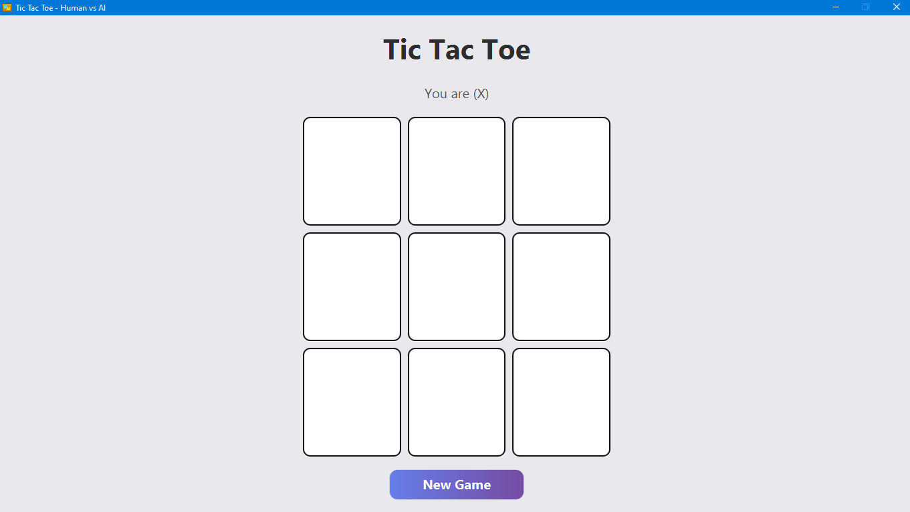
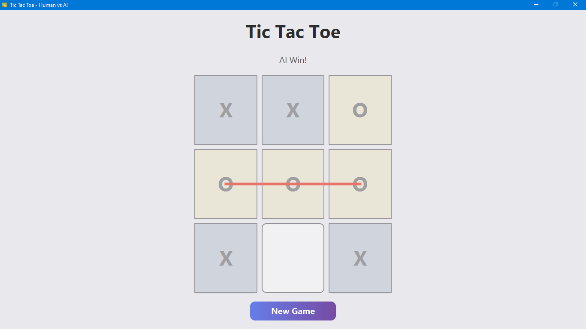

# Tic Tac Toe - JavaFX

A modern, responsive Tic Tac Toe game built with **JavaFX**. Play against an AI powered by the **Minimax algorithm**, with smooth animations and a scalable interface.

---


## Features

- Human vs AI gameplay using the **Minimax algorithm**.
- Responsive UI with scalable 3x3 grid buttons.
- Hover effects and custom button styling.
- Animated line to highlight the winning combination.
- Reset game functionality.
- Maximized window by default for optimal viewing.

---


## Screenshot of start



---


## Screenshot of won



---


## Folder Structure

```text
TicTacToeJavaFX/
│── screenshots/
│   |──after.PNG
|   |──after.PNG
├── src/
│   ├── main/
│   │   ├── java/
│   │   │   └── tic/tac/toe/game/
│   │   │       ├── GameLogic.java
│   │   │       ├── Main.java
│   │   │       ├── Player.java
│   │   │       ├── TicTacToeBoard.java
│   │   │       └── TicTacToeController.java
│   │   └── module-info.java
│   └── resources/
│       └── images/
│           └── icon.png
└── README.md

